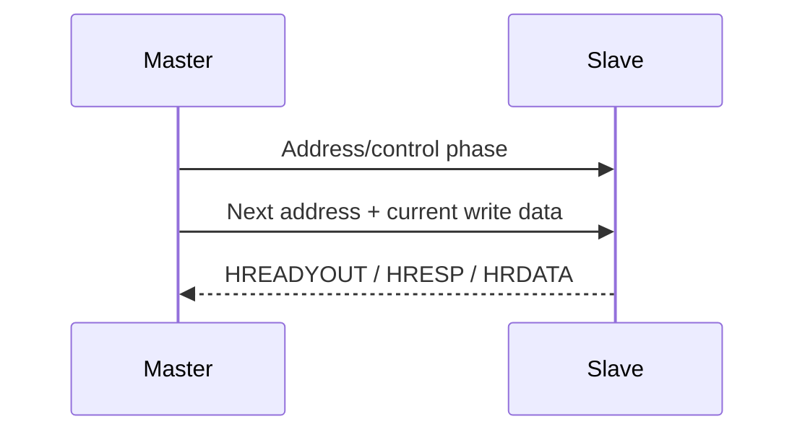

# AMBA AHB-Lite Memory Slave and UVM Verification

A synthesizable AHB-Lite memory slave with pipelined address/data phases, configurable wait states, two-cycle ERROR responses, UVM verification, SVA, coverage, and an executable smoke test.

## Pipeline



The design treats every valid NONSEQ/SEQ beat independently and supports overlapping completion and next-address capture. Invalid alignment, size, or range produces the mandatory two-stage ERROR response. See [the specification](docs/specification.md).

## Run

```bash
make uvm
make regress
make lint
make smoke
```

The smoke test executes eight writes, eight readbacks, and three error cases. Success prints `AHB_LITE_SMOKE_PASS checks=19`. The Xcelium regression adds constrained-random addresses, sizes, responses, and coverage.

See [verified results and tool scope](docs/verification_results.md) for the reproducible validation record.

## Common trap

`HWDATA` belongs to the previous cycle's address/control phase. Sampling address and write data together is a classic AHB scoreboard and RTL bug. This project explicitly pipelines control and consumes write data only when that transfer's data phase completes.

## License

MIT — see [LICENSE](LICENSE).
